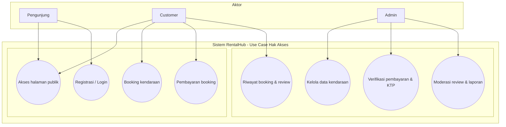
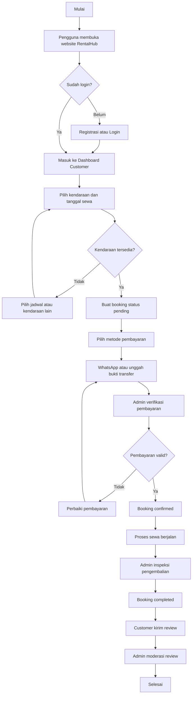

### 2.3 Struktur Sistem

Struktur sistem pada aplikasi RentalHub ini terdiri dari struktur menu, hak akses pengguna, serta alur kerja sistem.

#### 2.3.1 Struktur Menu

##### a. Menu Pengguna

Pada sistem ini, pengguna dapat melihat halaman publik terlebih dahulu. Namun, untuk melakukan pemesanan kendaraan, pengguna wajib melakukan registrasi dan login. Menu yang tersedia bagi pengguna antara lain:

1. Home View, yaitu halaman utama yang menampilkan ringkasan layanan RentalHub serta informasi kendaraan yang tersedia.
2. Browse Kendaraan, digunakan oleh pengguna untuk mencari kendaraan berdasarkan nama kendaraan, jenis kendaraan, atau rentang harga.
3. Detail Kendaraan dan Kalender Ketersediaan, digunakan untuk melihat spesifikasi kendaraan, harga sewa, serta jadwal ketersediaan unit.
4. Booking View, digunakan pengguna untuk membuat pemesanan kendaraan dengan menentukan tanggal sewa, waktu pengambilan, serta catatan tambahan.
5. Pembayaran View, digunakan pengguna untuk memilih metode pembayaran (WhatsApp atau unggah bukti transfer) dan memantau status pembayaran.
6. Library Booking (Riwayat Booking), digunakan untuk melihat daftar booking milik pengguna beserta status transaksi.
7. Profil dan Upload KTP, digunakan untuk melengkapi data akun dan mengunggah dokumen KTP untuk proses verifikasi.
8. Review View, digunakan pengguna untuk memberikan ulasan setelah booking selesai.

##### b. Menu Admin

Menu yang tersedia bagi admin antara lain:

1. Dashboard Admin, menampilkan ringkasan data kendaraan, booking, pembayaran, dan aktivitas operasional.
2. Manajemen Kendaraan, digunakan untuk menambah, mengubah, dan menghapus data kendaraan.
3. Manajemen Booking, digunakan untuk memverifikasi pembayaran, melakukan reschedule, dan menyelesaikan transaksi.
4. Kalender Armada, digunakan untuk melihat ketersediaan seluruh kendaraan, memblokir tanggal maintenance, dan mengatur aturan harga.
5. Verifikasi KTP, digunakan untuk menyetujui atau menolak dokumen identitas customer.
6. Moderasi Review, digunakan untuk menyetujui, menolak, atau menghapus review pengguna.
7. Laporan Transaksi, digunakan untuk melihat rekap transaksi dan monitoring pendapatan.

#### 2.3.2 Hak Akses Sistem

Hak akses dalam sistem ini dibagi berdasarkan peran pengguna, yaitu pengunjung, customer, dan admin.

Use case diagram pada Gambar 2.3.2 berikut menunjukkan pembagian hak akses berdasarkan aktor pada sistem RentalHub.

Berdasarkan diagram tersebut, pengunjung hanya memiliki akses baca ke halaman publik serta proses autentikasi. Customer memiliki akses transaksi seperti booking, pembayaran, riwayat, upload KTP, dan review. Admin memiliki akses penuh pada fitur operasional dan kontrol sistem, meliputi manajemen kendaraan, booking, verifikasi, kalender armada, moderasi review, dan laporan transaksi.

#### 2.3.3 Gambaran Alur Kerja Sistem

Alur kerja sistem pada RentalHub dapat dijelaskan dalam tahapan berikut:

1. Pengguna membuka website RentalHub dan menelusuri informasi kendaraan pada halaman publik.
2. Jika ingin melakukan pemesanan, pengguna melakukan login atau registrasi akun customer.
3. Customer memilih kendaraan, menentukan tanggal sewa, lalu membuat booking.
4. Sistem memvalidasi ketersediaan kendaraan agar tidak terjadi bentrok jadwal pemesanan.
5. Jika valid, sistem menyimpan booking dengan status awal pending.
6. Customer memilih metode pembayaran melalui WhatsApp atau unggah bukti transfer.
7. Admin melakukan verifikasi pembayaran.
8. Jika pembayaran valid, status booking diperbarui menjadi confirmed. Jika belum valid, status pembayaran tetap pending atau failed hingga customer memperbaiki data pembayaran.
9. Setelah masa sewa selesai, admin melakukan inspeksi pengembalian dan menyelesaikan transaksi.
10. Customer dapat memberikan review, lalu review dimoderasi oleh admin sebelum ditampilkan di sistem.

#### 2.3.4 Flow Chart Sistem

### 3.4 Kendala dan Solusi

Pada tahap implementasi sistem RentalHub, terdapat beberapa kendala yang muncul selama proses pengembangan dan pengujian. Kendala tersebut kemudian diselesaikan melalui perbaikan pada alur sistem, validasi data, dan penguatan proses operasional.

Kendala pertama adalah potensi bentrok jadwal pemesanan kendaraan ketika terdapat beberapa customer yang memesan unit yang sama pada rentang tanggal berdekatan. Solusi yang diterapkan adalah validasi ketersediaan kendaraan berbasis tanggal dan waktu sewa sebelum booking disimpan, sehingga sistem dapat menolak pemesanan yang overlap serta menjaga konsistensi data ketersediaan armada.

Kendala kedua adalah proses verifikasi pembayaran yang membutuhkan ketelitian karena metode pembayaran menggunakan konfirmasi WhatsApp dan unggah bukti transfer. Solusi yang dilakukan adalah menambahkan alur status pembayaran yang jelas (pending, paid, failed) dan menyediakan halaman verifikasi khusus bagi admin agar keputusan verifikasi dapat dilakukan secara terstruktur dan mudah ditelusuri.

Kendala ketiga adalah pengelolaan dokumen identitas customer (KTP), terutama pada tahap unggah, validasi, dan persetujuan admin. Solusi yang diterapkan yaitu pemisahan alur upload KTP di profil customer, penambahan status verifikasi KTP, serta modul verifikasi KTP di sisi admin agar proses persetujuan dokumen berjalan lebih tertib.

Kendala keempat adalah sinkronisasi status transaksi dari awal pemesanan sampai penyelesaian pengembalian kendaraan. Solusi yang dilakukan adalah penegasan alur status booking dan pembayaran pada setiap tahap proses, termasuk saat verifikasi, konfirmasi, dan penyelesaian transaksi, sehingga perubahan status lebih konsisten antara sisi customer dan admin.

Kendala kelima adalah menjaga kualitas ulasan agar konten yang tampil tetap relevan dan sesuai kebijakan sistem. Solusi yang diterapkan adalah fitur moderasi review oleh admin, sehingga setiap ulasan dapat ditinjau terlebih dahulu sebelum dipublikasikan.

Dengan penerapan solusi tersebut, proses operasional RentalHub menjadi lebih stabil, alur kerja admin lebih terarah, serta pengalaman pengguna dalam melakukan pemesanan kendaraan menjadi lebih aman dan terstruktur.

### 4.1 Kesimpulan

Berdasarkan hasil perancangan dan implementasi, alur kerja sistem RentalHub telah berjalan secara terstruktur mulai dari proses pengguna menelusuri kendaraan, melakukan login, membuat booking, melakukan pembayaran, verifikasi oleh admin, hingga penyelesaian transaksi dan pemberian review. Alur ini menunjukkan bahwa proses bisnis penyewaan kendaraan dapat dikelola dalam satu sistem yang saling terhubung dari tahap awal sampai tahap akhir.

Manfaat utama dari sistem ini adalah mempermudah customer dalam melakukan pemesanan kendaraan secara online, memantau status transaksi, serta melakukan pembayaran dengan lebih praktis. Dari sisi admin, sistem membantu pengelolaan data kendaraan, verifikasi dokumen dan pembayaran, pengaturan jadwal armada, serta penyusunan laporan transaksi secara lebih cepat dan rapi.

Dampak penerapan RentalHub adalah meningkatnya efisiensi operasional dan ketertiban administrasi pada usaha rental kendaraan. Risiko kesalahan pencatatan, bentrok jadwal, dan keterlambatan proses verifikasi dapat diminimalkan, sehingga kualitas layanan kepada customer meningkat dan pengambilan keputusan bisnis menjadi lebih tepat karena didukung data transaksi yang terdokumentasi dengan baik.
